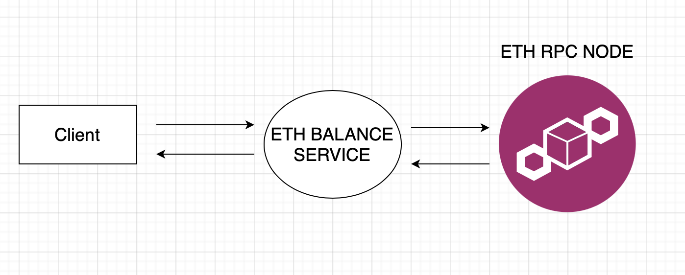

# ETH-BALANCE-PROXY

This is a simple service to proxy Ethereum RPC Endpoint for balance info.



Due to the requirements, this repo includes only 4 endpoints:

* _/eth/balance/{address}_ endpoint [GET]: Proxies the RPC endpoint and returns ether amount.

Example for success response:

```
{
    "balance": "29065829.2212146572",
    "unit"   : "ether"
}
```

Example for fail response:

```
{
  "Message": "address is not valid",
  "Code": 400
}
```

* _/live_ endpoint [GET]: This is to be integrated with kubernetes to provide liveness concept which proves whether the
  service is alive. Unless it returns successful, the pod should restart with kubernetes configurations. Basically
  returns 200 as http status code to prove the service is alive.
* _/ready_ endpoint [GET]: This one is also for kubernetes integration and is for readiness concept that represents
  whether service can accept traffic. Endpoint checks eth_syncing method from RPC Endpoint once it is hit and returns
  the response based on that.
* _/metrics_ endpoint [GET]: Shows prometheus metrics of the application.

### Ethereum RPC Endpoint

For the RPC Endpoint you may use one from Infura.

RPC Endpoints used in this project:

* Balance Endpoint: https://docs.infura.io/networks/ethereum/json-rpc-methods/eth_getbalance
* ETH Syncing Endpoint: https://docs.infura.io/networks/ethereum/json-rpc-methods/eth_syncing

### How to run the tests

There are two test files currently: `/router/api_test.go` and `/client/rpc_client_test.go`

To run all tests in one command:
`go test ./...`

### How to run service with docker

1. Make sure to set your RPC Endpoint in dockerfile and update RPC_ENDPOINT

2. On the project's directory to create an image:

`
docker build -f ./dockerfile -t eth-balance-proxy-app:latest .
`

3. And to run the container:

`
docker run -p  127.0.0.1:1903:1903 eth-balance-proxy-app
`

### Assumptions and considerations

* We assume that this service will be deployed to kubernetes as a pod. There can be multiple replicas based on the
  traffic.
* _/live_ endpoint is for liveness in kubernetes. Once it returns with http code other than 200, pod should restart.
* _/ready_ endpoint is to tell if pod is ready for accepting traffic. We could have many replicas which each one has
  different configurations and pointing to a different RPC Node could solve the problem "service unavailability" when a
  node is eth_syncing process so that others accept traffic and service is responsible. However, this brings another
  question if a node is behind of chain compared to others. So that means our service may respond inconsistent data.
* Data from _/metrics_ endpoint to be consumed by Grafana or one monitoring tool for visibility so that needed
  parameters could be monitored and related alert notifications are triggered.
* We could have rate limits
* We could run stress tests once pods' memory limits are decided.